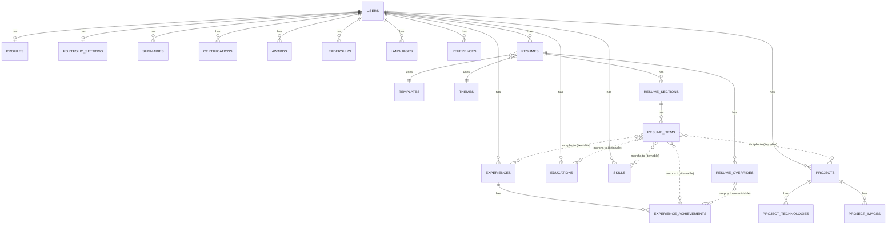

# CareerForge — ERD

> Source: CareerForge Complete Technical Architecture v1.0. Companion documents: see /requirements folder for product requirements

## 12. ERD
### 12.1 Textual ERD (Key Relationships)

```
users (1) ── (1) profiles
users (1) ── (1) portfolio_settings
users (1) ── (*) summaries
users (1) ── (*) experiences ── (*) experience_achievements
users (1) ── (*) educations
users (1) ── (*) skills
users (1) ── (*) projects ── (*) project_technologies
                          └── (*) project_images
users (1) ── (*) certifications
users (1) ── (*) awards
users (1) ── (*) leaderships
users (1) ── (*) languages
users (1) ── (*) references
users (1) ── (*) resumes ── (*) resume_sections ── (*) resume_items ──▷ [morphs to any master record]
                          └── (*) resume_overrides ──▷ [morphs to any master record]
resumes (*) ── (1) templates
resumes (*) ── (1) themes
```

### 12.2 Mermaid ERD


*(Mermaid doesn't have native polymorphic-relationship notation, so the `morphs to` edges above are illustrative of the pattern rather than literal foreign keys — `resume_items`/`resume_overrides` have no real FK constraint to any single one of those tables, by design.)*

---
